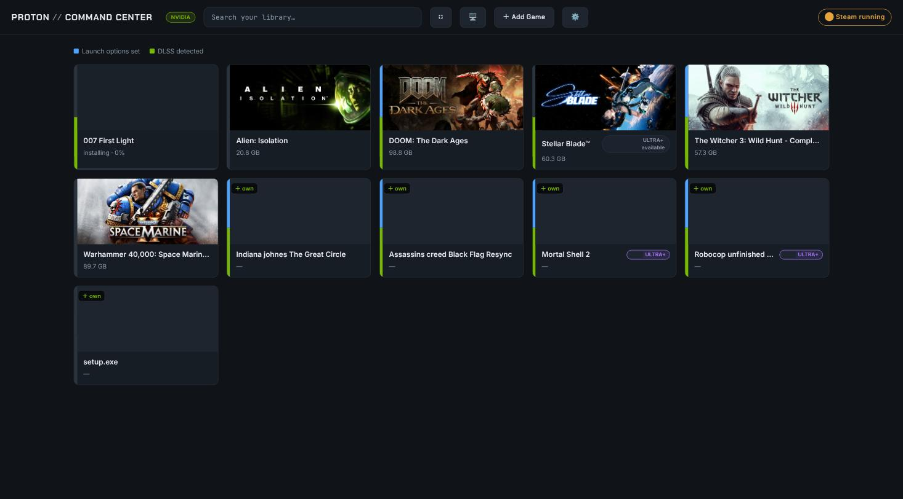
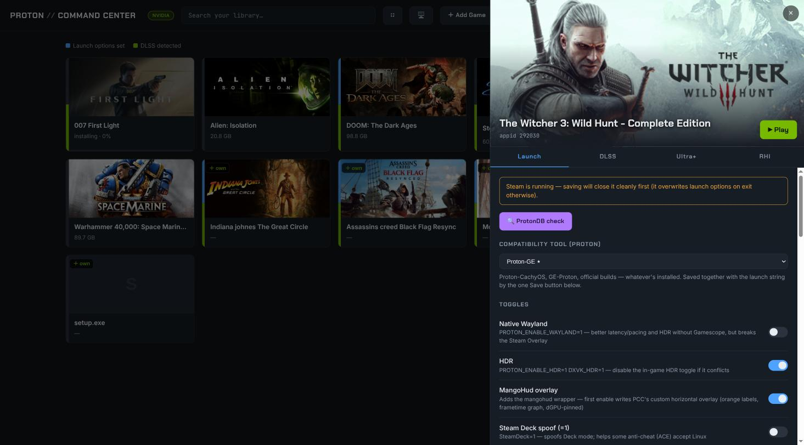
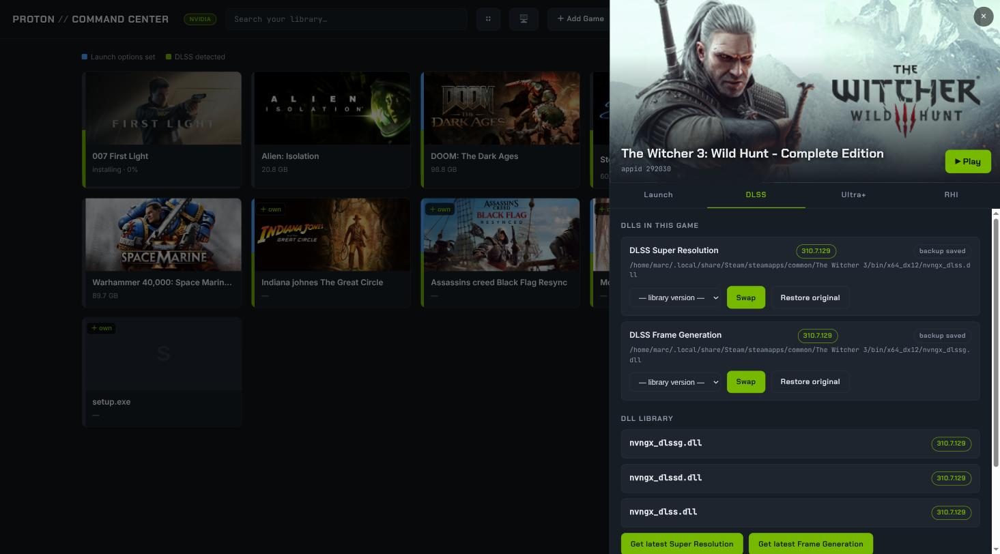
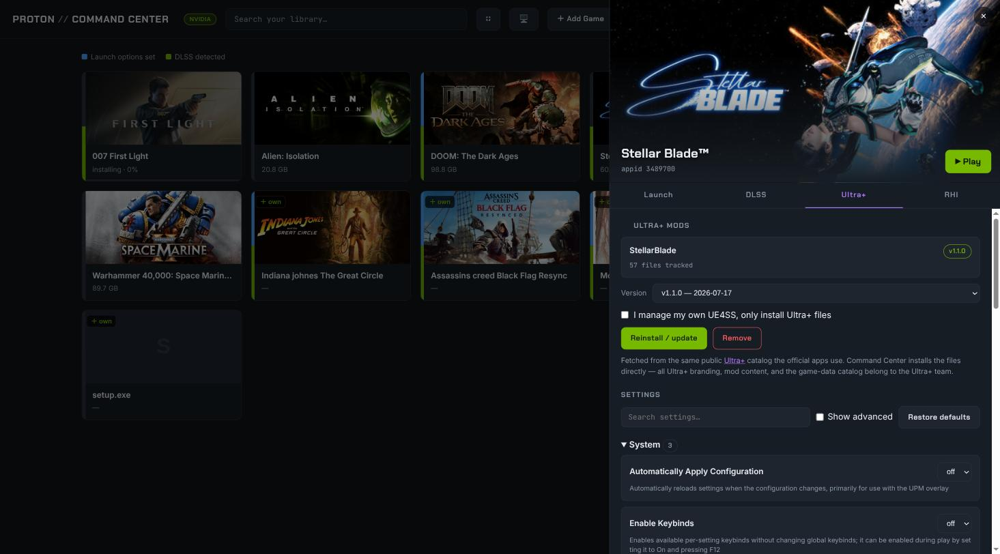
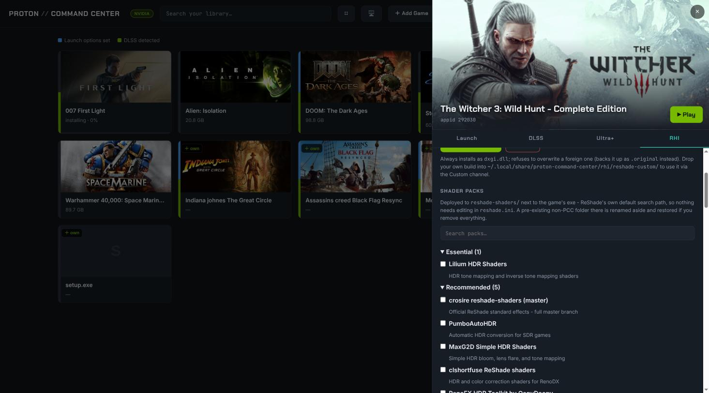
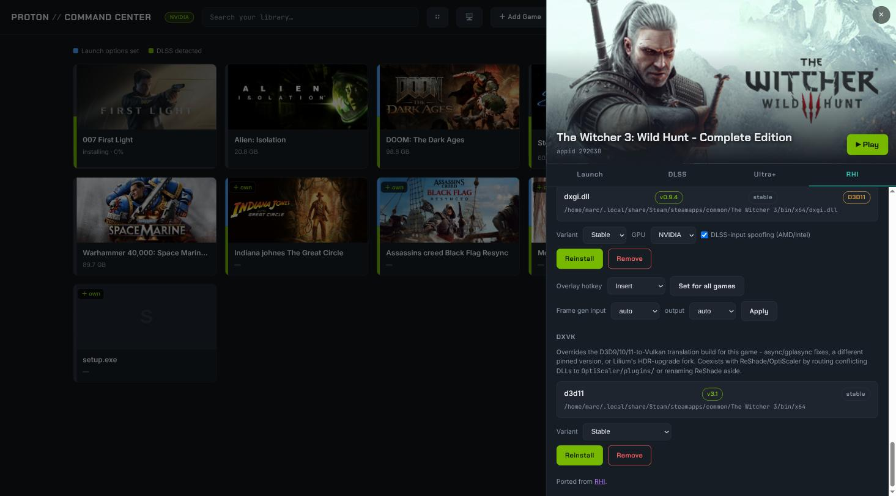

# Proton Command Center

Steam on Linux hides the settings that matter. Launch options are a
single-line text box. Proton versions are a dropdown with no idea what each
build supports. DLSS DLLs mean hunting through game folders. Graphics mods
mean a separate Windows app running under Wine, if it runs at all.

This puts all of it in one place, in your browser, on your machine.



```
http://localhost:8686
```

Python standard library only. No dependencies, no telemetry, no account.

---

## What it does

- **Launch options from toggles, not guesswork.** DXVK, HDR, Wayland,
  Reflex, and more - each one says what it does. Scans your installed Proton
  builds and greys out anything a build can't actually act on.
- **DLSS DLL management.** Every DLL in a game, its version, one-click
  upgrade, backups you can roll back.
- **Native Ultra+ mod install.** No separate Ultra+ Manager needed - install,
  update, and remove UE4SS-based mods from [theultraplace.com](https://theultraplace.com)
  directly.
- **Native RHI port.** ReShade (all channels), shader packs, addons,
  OptiScaler, and DXVK variant management - installed directly, no separate
  Windows app. See [RHI tab](#rhi-tab) below.
- **Full controller navigation.** Fullscreen, spatial nav, a hint bar with
  the mapping - built for the sofa.

---

## Requirements

| | |
|---|---|
| **Required** | Python 3, Steam (logged in once) |
| **Optional** | `mangohud` for the overlay, an NVIDIA driver for DLSS features |
| **Optional** | `7zip` (or `p7zip`) - needed for OptiScaler, DXVK's Lilium HDR variant, and some shader packs (e.g. Lilium HDR Shaders) - all ship as `.7z` |

Built and tested on Arch-based distros with an NVIDIA slant. Nothing is
Arch-specific beyond the install script.

## Install

```bash
tar xzf proton-command-center-*.tar.gz
cd proton-command-center
./install.sh
```

Or from the AUR:

```bash
yay -S proton-command-center
systemctl --user enable --now proton-command-center
```

Either way you get a launcher, an app-menu entry, and a systemd user service
that starts at login and restarts itself if it dies.

## Two optional keys

Both free, both stored locally in `config.json` (mode 0600), both used only
server-side. Skip them and everything else still works.

- **[SteamGridDB](https://www.steamgriddb.com)** - artwork for games Steam's
  CDN misses.
- **[Steam Web API](https://steamcommunity.com/dev/apikey)** - your full
  owned library, not just what's installed.

---

## The details

### Launch tab



Toggle list covers the common cases (DXVK, HDR, Wayland, MangoHud, Reflex,
DLSS auto-updater, VKD3D descriptor-heap, FSR4 upgrade) plus the
`WINEDLLOVERRIDES` hijacks the Ultra+ and OptiScaler-on-Vulkan features need.
Anything niche goes straight into "Extra env vars" - nothing already saved
gets silently dropped. Saving needs Steam closed; confirm and it closes
Steam cleanly, saves, and offers a one-click restart.

### DLSS tab



Every DLSS DLL in the game, ready to swap or roll back. The Launch tab's
DLSS section covers Super Resolution preset, Frame Generation (2x-6x), and
Ray Reconstruction via `DXVK_NVAPI_DRS_*` - read straight from the selected
Proton build's own dxvk-nvapi, so unsupported options grey out instead of
silently doing nothing.

### Ultra+ tab



Installs, updates, and removes [Ultra+](https://theultraplace.com) mods
directly. Reinstalling over an existing copy updates it while merging your
config edits into the new file; mod presets show up as one-click apply.

### RHI tab



A native port of [RHI](https://github.com/RankFTW/RHI)'s mod-management
tools - everything below runs as a direct file install, no separate Windows
app or Wine-hosted process:

- **ReShade** - Stable, No Addons, Nightly, Legacy, and Custom channels,
  with an RE Framework companion for RE Engine games.
- **Shader packs & addons** - ReShade's real community catalogs, deployed to
  its own default search paths.
- **OptiScaler** - redirects DLSS/FSR/XeSS calls to any upscaler + frame
  gen, on any GPU. Coexists with ReShade automatically.
- **DXVK** - Development, Stable, or Lilium HDR variant, per game. Coexists
  with ReShade and OptiScaler automatically (conflicting DLLs route through
  `OptiScaler/plugins/`, or ReShade gets renamed aside).



Vulkan games don't get ReShade (the Windows implicit-layer mechanism doesn't
work under Wine); OptiScaler still works there via its `winmm.dll` path.

### ProtonDB check

Fetches the game's community rating and shows a tier badge.

### System panel

Names your CPU and GPU properly, and configures the MangoHud overlay.

### Controller

| Input | Action |
|---|---|
| D-pad / left stick | Move |
| **Right stick** | Scroll long lists |
| **A** | Select |
| **B** | Back |
| **X** | Play or Install |
| **Y** | Search |
| **LB / RB** | Cycle tabs |
| **Start** | Settings |
| **Select** | Fullscreen |

Navigation is spatial. Confirmations are drawn in-page, since a native
browser dialog freezes the pad polling loop.

Steam's own install dialog is a separate window and out of this app's
control - use Steam's Desktop Layout (Settings → Controller) to drive it
with a pad.

Fullscreen is also on ⛶ or **F11**; **Esc** always leaves.

### Settings

**Backup & restore** - DLL library, launch settings, MangoHud config, API
keys, ProtonDB ratings, into one timestamped `.tar.gz`.

**Proton versions** - recent GE-Proton releases, one-click install into
`compatibilitytools.d`.

---

## Updating

Re-run `./install.sh`, or `yay -S proton-command-center`. A red banner means
the backend is older than the frontend: `systemctl --user restart
proton-command-center` and refresh.

## Troubleshooting

| Symptom | Fix |
|---|---|
| Missing artwork | Gear → Clear art cache & re-fetch |
| Backend not responding | `systemctl --user restart proton-command-center` |
| "Steam is running" on save | Expected - confirm and it closes Steam cleanly |
| OptiScaler on a Vulkan game does nothing in-game | Enable the "OptiScaler Vulkan-game loader" toggle on the Launch tab |

## Uninstall

```bash
./uninstall.sh           # asks before deleting user data
./uninstall.sh --purge   # everything, including user data
```

Restore any swapped DLLs before purging.

## Development

```bash
python3 -m unittest discover -s tests
```

Tests build a mock Steam install in a temp dir, so they run anywhere. A
second instance won't disturb your service: `PCC_PORT=8687 python3 pcc.py`.

## Credits

- **Ultra+** and its UE4SS-based mods are made by the Ultra+ team at
  [theultraplace.com](https://theultraplace.com). Command Center installs,
  updates, and removes these mods directly, fetching from the same public
  catalogs the official apps use.
- **RHI** ([RankFTW/RHI](https://github.com/RankFTW/RHI)) is the source
  this app's ReShade/shader/addon/OptiScaler/DXVK management was ported
  from - a native Linux port of its install logic, built to work without
  Wine or a separate Windows app.

Both are independent, unofficial integrations. Command Center is not
affiliated with or endorsed by either project; all branding, mod content,
and catalogs remain the property of their respective owners.

MIT. Copyright (c) 2026 Marc Gibb.
